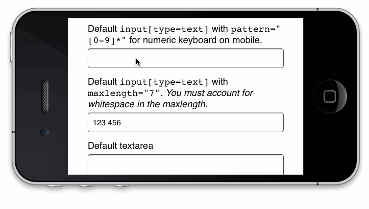

# Politespace

## [Demo](http://filamentgroup.github.io/politespace/demo/demo.html)

## Using Politespace

Add `data-politespace` to your form’s `input[type=text]` (et al) or `textarea` and we’ll add spaces to the value when the user blurs off of it. We’ll also remove those spaces on focus.

### data-politespace-grouplength

To customize the number of spaces, use the `data-politespace-grouplength` attribute (it defaults to 3). It can be:

 * single number (to uniformly repeat, like a credit card)
 * a comma delimited list (for non-uniform strings, like "2,4" for MM YYYY). This also works with open ended commas, like "2," for MM YYYY or "3,3," for a US phone number.

Use `pattern="[0-9]*"` for numeric keyboards on iOS.

This script now works reliably cross-browser with `<input type="number">`. It should be noted that independent of `politespace`, WebKit removes the value on blur when a user types or a script adds a non-numeric character in the field, for example: `myElement.value = "1,000"`. We’re now creating a proxy element on top of the form element to workaround this issue and display the formatted value.

Make sure your `maxlength` value is large enough to allow for the addition of the whitespace.

### data-politespace-delimiter

The default delimiter is a space, but you can add `data-politespace-delimiter` to customize to a different character.

### data-politespace-reverse

When delimiting money, for example, you want the grouplengths to be calculated from the lowest digit to the greatest (from right to left). Use `data-politespace-reverse` to opt into this behavior. A USD Price example: `data-politespace-grouplength="3" data-politespace-delimiter="," data-politespace-reverse`

### data-politespace-decimal-mark

When delimiting money as a floating point, you’ll want to exclude the fractional portion of the number when inserting delimiters. For example, $4,000.34 will need `data-politespace-delimiter="," data-politespace-decimal-mark="."` (or for proper internationalization, $4 000,34 will need `data-politespace-delimiter=" " data-politespace-decimal-mark=","`).

### data-politespace-strip

Specify a regular expression of characters to remove before formatting the field. To strip out all non-numeric characters (for example, for a telephone number), use `data-politespace-strip="[^\d]*"`. This is an alternative to [the `numeric-input` plugin of `formcore`](https://github.com/filamentgroup/formcore#numeric-input).

### data-politespace-creditcard

When using politespace with credit card fields, the formatting logic changes based on the first digit. For example, American Express (AMEX) card formats are 4,6,5 (15 characters total, the first digit is a 3) and Visa/Mastercard/Discover are 4,4,4,4 (16 characters). If you use the `data-politespace-creditcard` attribute (in lieu of a `data-politespace-grouplength`) politespace will automatically adjust the politespace group length for you. If you add the `data-politespace-creditcard-maxlength` attribute, politespace will also manage the field’s maxlength for you as well.

`<input type="text" pattern="[0-9]*" data-politespace data-politespace-creditcard data-politespace-creditcard-maxlength>`

Uses the [`creditable`](https://github.com/filamentgroup/creditable) dependency.

### data-politespace-us-telephone

When using politespace with US specific telephone number fields, `data-politespace-us-telephone` option will automatically adjust the maxlength of the field to account for a US country code. If the user types a 1, the maxlength will be adjusted to add one additional character until the user blurs, when the country code will be stripped and the original maxlength restored.

### Download

* [politespace.js](http://filamentgroup.github.io/politespace/dist/politespace.js)
* _Optional:_ [politespace-init.js](http://filamentgroup.github.io/politespace/dist/politespace-init.js), performs auto initialization, calls `$( ".elements" ).politespace()` for you.
* [politespace.css](http://filamentgroup.github.io/politespace/dist/politespace.css)

### NPM

`npm install politespace`

### Beware input masks.

This plugin was created as a less intrusive alternative to the common input mask, which have serious accessibility implications:

> A quick [screen/audio recording of tabbing around a form using JS input masks](https://docs.google.com/file/d/0B9rGmqNcHo-mRGpMS0xQbzVzeGM/edit) with VoiceOver enabled.

—[@scottjehl](https://twitter.com/scottjehl/status/317313054503211010)

> Just a friendly monthly reminder that input mask plugins make your forms sound like a jackhammer to people who use a screen reader. Cheers!

—[@scottjehl](https://twitter.com/scottjehl/statuses/317291417326206976)

## [Tests](http://filamentgroup.github.io/politespace/test/test.html)

## Using the repo

Run these commands:

 * `npm install`
 * `grunt` as normal

## License

[MIT License](http://en.wikipedia.org/wiki/MIT_License)
